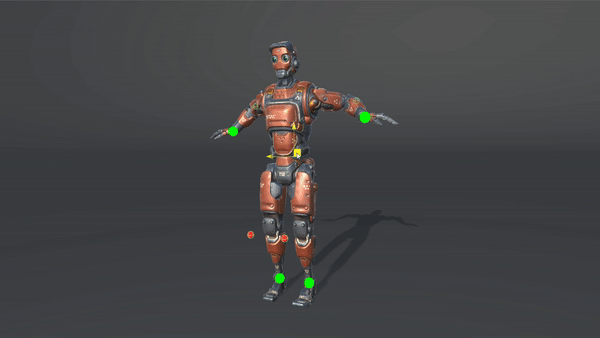

## EasyIK - A fast and simple Inverse Kinematics solver (FABRIK) for Unity.

## Setup
* Drag and drop the script om the root joint.
* Set the correct number of joints.
* Assign a IK Target transform.
* Assign a Pole Target transform (Only comptaible with 3-joint chains).
* Tweak settings to get desired results.

## Upcoming features
* ~Visual debugger.~ :heavy_check_mark:
 * ~Pole vector/target constraint.~ :heavy_check_mark:
 * Joint rotation constraints.
 * The option to choose specific bones that should be in the IK chain. 

## Known bugs
* ~IK joints sometimes rotate incorrectly.~ :heavy_check_mark:
* IK target transform need to have same local rotation as the leaf bone.
